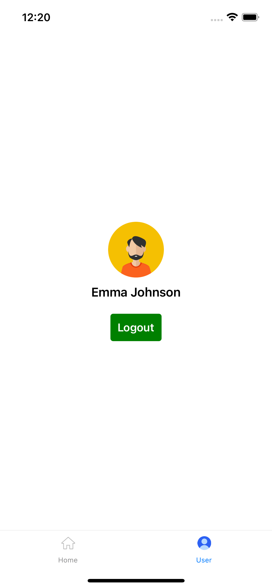

# Avegen Health Care
Welcome to avegenHealthCare! This project aims to provide a healthcare management system that allows users to track and manage their health records and appointments conveniently.

<kbd>

</kbd>
## Installation

1. Clone the repository:
```shell
git clone https://github.com/vinitgundeti/avegenHealthCareProject.git
```
2. Navigate to the project directory:
```shell
cd avegenHealthCareProject
```
3. Install the dependencies:
```shell
npm install
```
4. Run the following command to start the API server:
```shell
npx json-server --watch db.json --port 3002
```
5. For Android, run the following command to launch the app:
```shell
npx react-native run-android
```
6. For iOS, use the following command to run the app:
```shell
npx react-native run-ios
```

**For Login, You can select any listed user**

<kbd>

</kbd>

**To Logout, Go to users screen and you can logout from there**

<kbd>

</kbd>
